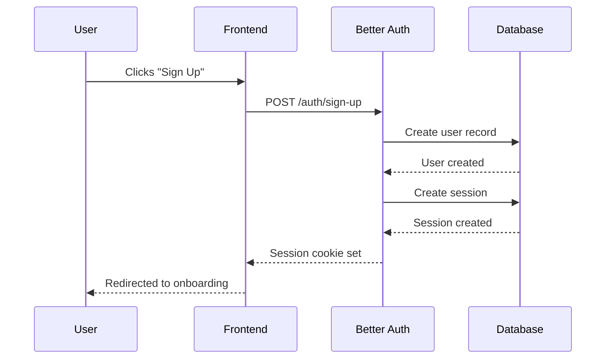
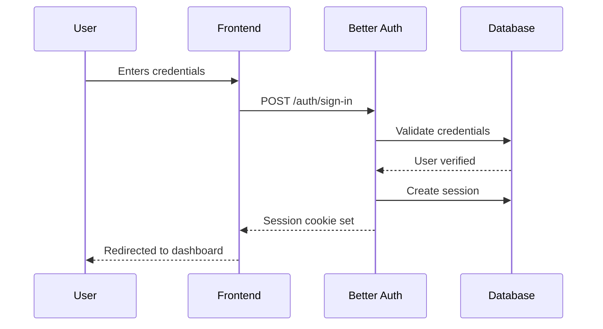
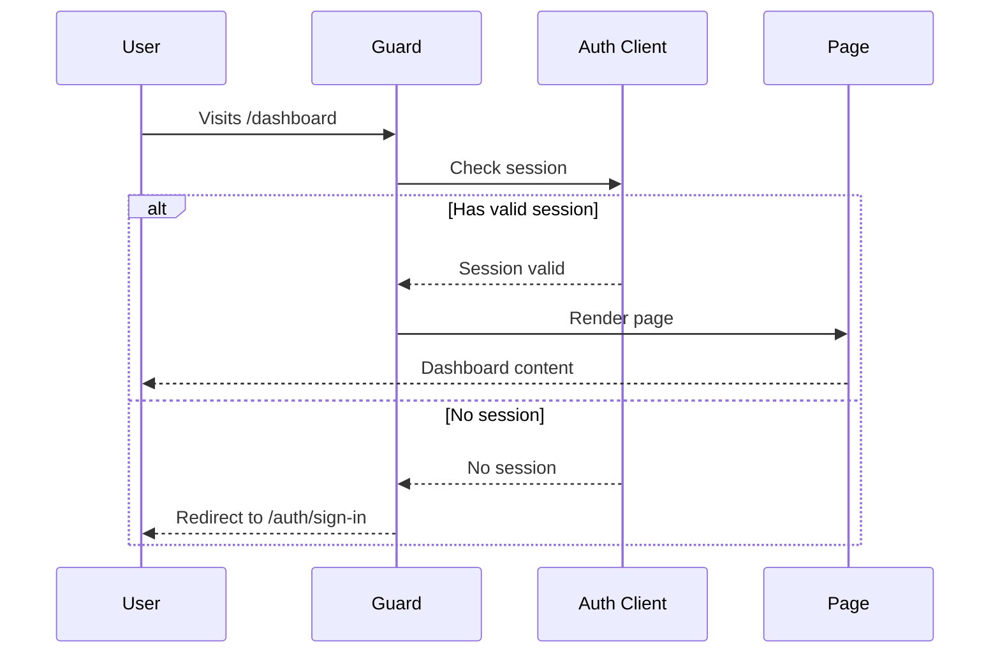

# Authentication Flow

> **Level:** 🟢 Beginner | **Time:** ⏱️ 10 min

Understand how authentication works in FlowStack from sign-up to protected content.

---

## User Journey

### 1. Sign Up Flow



### 2. Sign In Flow



### 3. Protected Route Access



---

## Key Concepts

### Sessions

- Sessions are stored in the database
- A session cookie is set in the browser
- Sessions have an expiry time (configurable)
- Multiple sessions per user are supported

### Guards

Guards are React components that check authentication:

| Guard | Purpose |
|-------|---------|
| `ProtectedRoute` | Requires user to be signed in |
| `RequireOnboarding` | Requires onboarding to be complete |
| `SignedIn` | Renders children only if signed in |
| `SignedOut` | Renders children only if signed out |

### Auth Client

The auth client (`authClient`) provides:
- Session state management
- API methods for auth operations
- Hooks for React components

```tsx
import { authClient } from "@/lib/auth-client";

// Get current session
const { data: session } = await authClient.useSession();

// Sign out
await authClient.signOut();
```

---

## 👉 Next: [Architecture Overview](./architecture.md)
